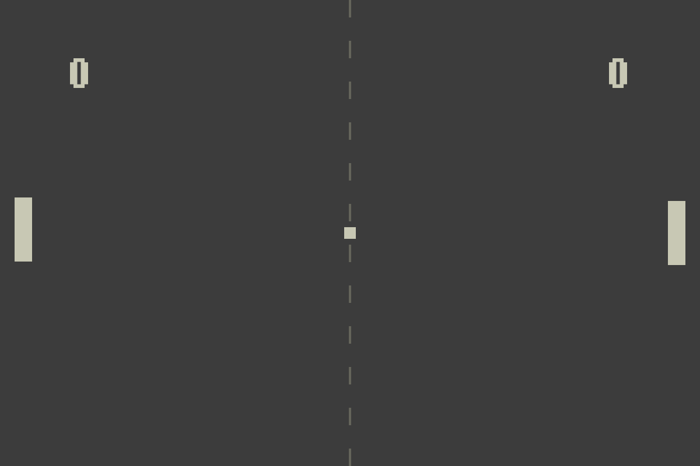

# **PONG**
Arcade game recreating the iconic game from the very early days of the industry.

## **Requirements**
- [python](https://example.com) 3.x
- [pygame](https://example.com) : python library

## **Set Up**
### **Cloning the Repository**
Clone the repository.
``` bash
git clone https://github.com/TrKimico/Pong-Game.git
```
Navigate into the repository you just downloaded.
``` bash
cd Pong-Game
```

### **Playing**
```bash
python3 pong.py
```

Side Note: AI was only used in this project for debugging purposes, 99% of the code is handwritten.
